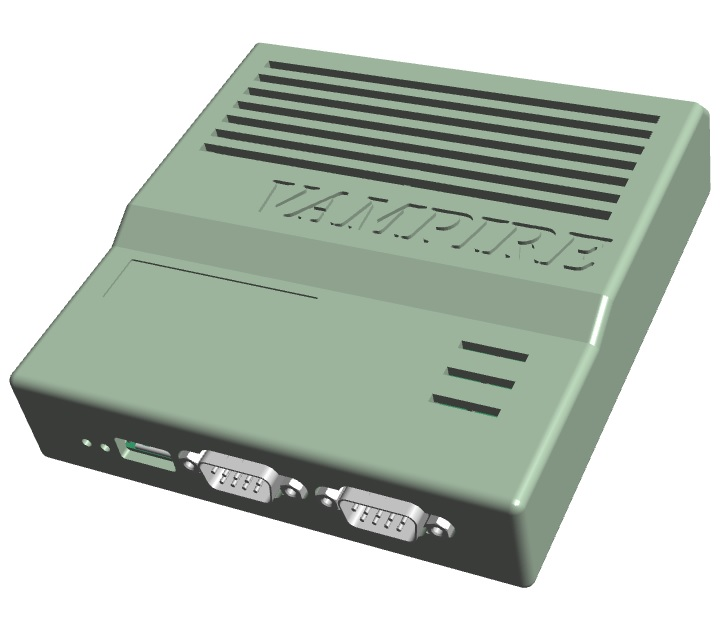
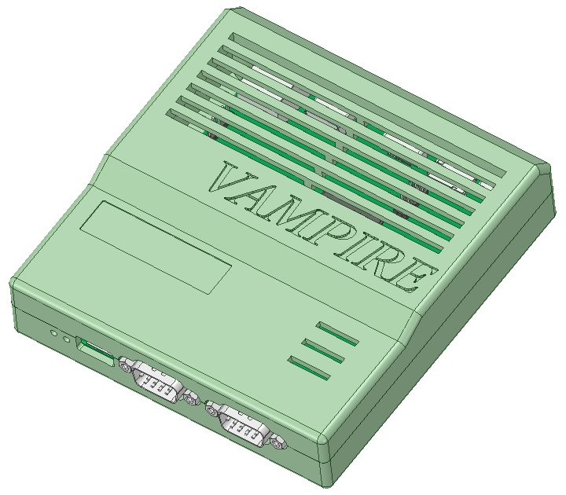
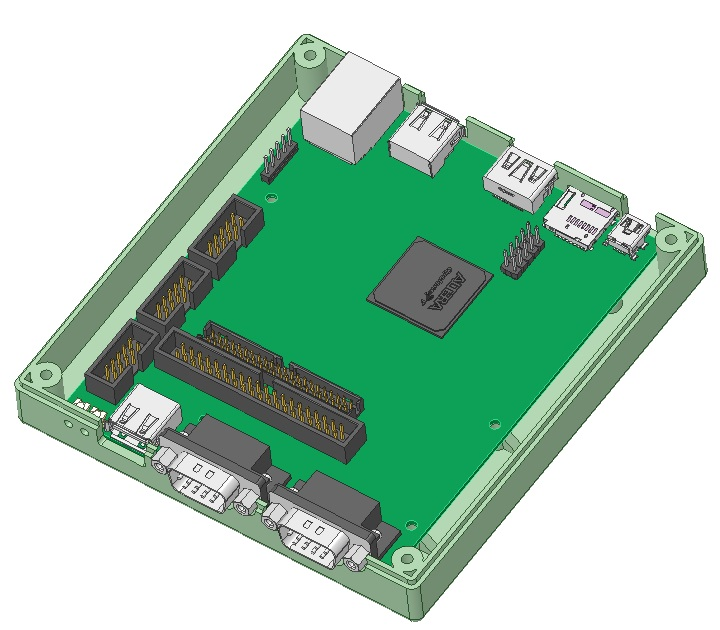
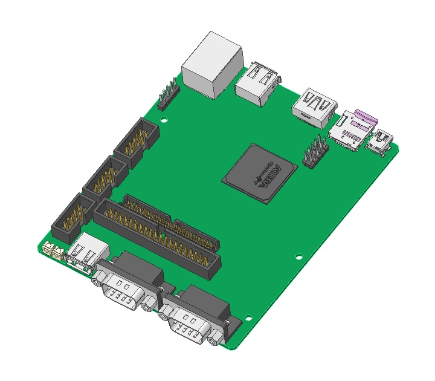
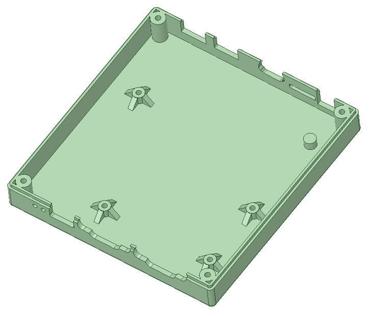
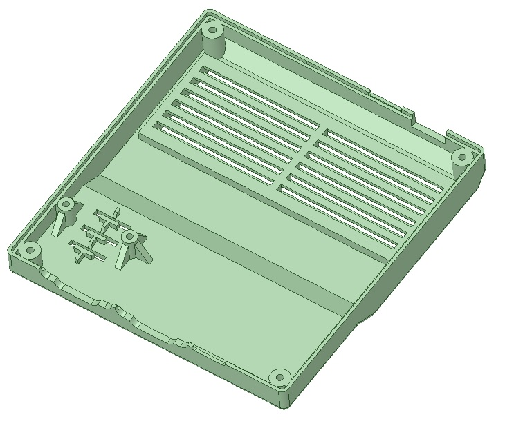

# Vampire V4 Standalone Enclosure
A Classic Amiga Enclosure for the Vampire V4 Standalone PCB

3d-model was created in DesignSpark Mechanical 4.0

All dimensions reverse engineered using a digital caliper measuring a real Vampire V4 PCB rev 3C

Why no STEP-file? Sorry I do not have the Exchange add-on module to export geometry to STEP and IGES formats. The free version of Designspark Mechanical 4.0 doesn't support it.

***

Under Construction...

For 3d-printing scroll further down!

Under Construction...
