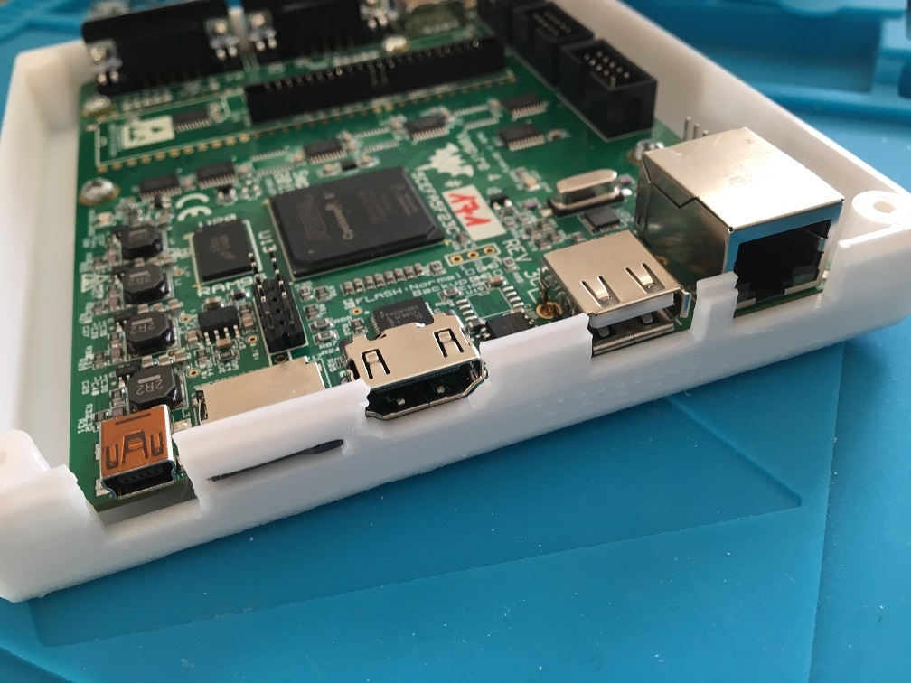
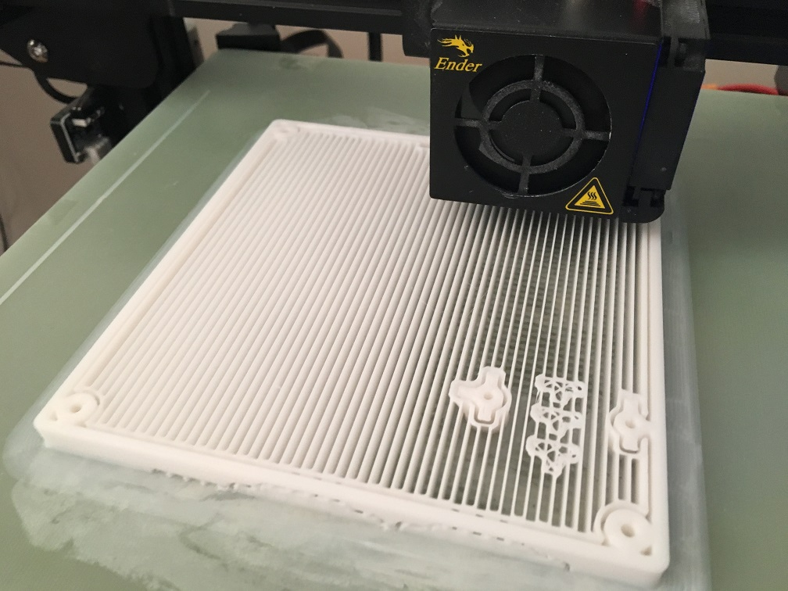

# Vampire V4 Standalone Enclosure
A Classic Amiga Enclosure for the Vampire V4 Standalone PCB

3d-model was created in DesignSpark Mechanical 4.0

All dimensions were reverse engineered using a digital caliper measuring a real Vampire V4 PCB rev 3C

Why no STEP-file? Sorry I do not have the Exchange add-on module to export geometry to STEP and IGES formats. The free version of Designspark Mechanical 4.0 doesn't support it.

***

***

***

### 3d-printing:

Bottom part:

I printed this part using PLA 60% infill, 220/80°C (Nozzle/Bed temp) and with a Brim slicing in Cura...Print took about 8h to finish for Mr Ender.

***

 

Top part:
 
I printed this part using PLA 60% infill, 220/80°C (Nozzle/Bed temp) and with a Brim and Support Structure enabled when slicing in Cura...I first tried printing it upside down on several trials but didn't manage to get the Vampire-text to come out good. I then switched tactic to print it the "correct" way enabling/generating support structure when slicing in Cura. Print took about 15h!!!, and it was a lot of trimming to do afterwards to remove the "guts".

 

Under Construction...
